# Frontend - iPhone 18 Pro Concept Landing Page

Frontend là landing page giới thiệu sản phẩm công nghệ theo phong cách hiện đại, cao cấp và responsive. Dự án chọn sản phẩm demo là iPhone 18 Pro Concept, tập trung vào hero section mạnh về thị giác, section tính năng, thông số kỹ thuật, form đăng ký nhận tin, animation khi cuộn, dark mode, chatbot và luồng thương mại điện tử mini.

## Công Nghệ Sử Dụng

- React 19
- Vite 8
- CSS thuần theo component, CSS variables cho theme
- GSAP + ScrollTrigger cho scroll animation và parallax nhẹ
- Three.js, React Three Fiber, Drei cho khả năng mở rộng 3D
- `react-lite-youtube-embed` để nhúng video tối ưu hơn iframe thường
- REST API helper qua `src/lib/api.js`

## Tính Năng Chính

- Hero section có hình sản phẩm, thông điệp chính và CTA rõ ràng.
- Section video sản phẩm được lazy-load.
- Section tính năng nổi bật lấy dữ liệu từ `src/data/landingData.js`.
- Section thông số kỹ thuật.
- Section kể chuyện sản phẩm theo dạng scrollytelling.
- Form đăng ký nhận tin có validate tên/email, loading, success và error state.
- Có thể gửi dữ liệu form về Google Sheet hoặc webhook thật.
- Theo dõi hành vi người dùng: click CTA, submit form và mốc scroll 25%, 50%, 75%.
- Toast realtime hiển thị sự kiện tương tác.
- Dark mode / light mode.
- Responsive desktop, tablet và mobile.
- SEO technical trong `index.html`: title, description, Open Graph, Twitter card, favicon, theme color.
- Mini commerce: đăng ký, đăng nhập, danh sách sản phẩm, chi tiết sản phẩm, yêu thích và giỏ hàng.
- Chatbot tư vấn sản phẩm ở góc màn hình, gọi API `/api/chatbot/message`.

## Đáp Ứng Yêu Cầu Đề Bài

| Yêu cầu | Cách triển khai |
| --- | --- |
| Hero Section | `src/components/Hero.jsx` |
| Tính năng nổi bật | `src/components/Features.jsx`, dữ liệu trong `src/data/landingData.js` |
| Thông số kỹ thuật | `src/components/Specs.jsx` |
| Form đăng ký nhận tin | `src/components/Signup.jsx`, xử lý trong `src/App.jsx` |
| Responsive | `src/styles/*.css` và critical CSS trong `index.html` |
| Performance mobile | WebP image, preload hero image, lazy section, dynamic import, lite YouTube |
| SEO Technical | Meta title, description, Open Graph, Twitter card trong `index.html` |
| Kết nối dữ liệu ngoài | `VITE_API_BASE_URL`, `VITE_GOOGLE_SHEETS_WEB_APP_URL`, `VITE_WEBHOOK_URL` |
| Dark Mode | Toggle trong `Header.jsx`, theme bằng `data-theme` |
| Scroll Animation | GSAP + ScrollTrigger được tải sau tương tác đầu tiên |
| Scrollytelling | `src/components/Story.jsx` |
| Mini commerce | `ProductsPage`, `ProductDetailPage`, `FavoritesPage`, `CartPage`, `AuthPage` |
| Chatbot | `src/components/ChatbotWidget.jsx` |

## Cấu Trúc Thư Mục

```text
src/
  App.jsx                 Điều hướng view, theme, tracking, newsletter submit
  main.jsx                Entry point React
  lib/api.js              API helper, token, format tiền, fallback ảnh
  data/landingData.js     Nội dung landing page
  components/             Header, Hero, Features, Specs, Story, Signup, commerce pages, chatbot
  styles/                 CSS chia theo nhóm giao diện
  assets/                 Asset dùng trong source
public/
  fonts/                  Font local dùng font-display: swap
  iphone.webp             Ảnh hero tối ưu
  iphone.png              Fallback image
  og-image.svg            Open Graph image
  favicon.svg             Favicon
index.html                SEO meta, preload asset, critical CSS
vite.config.js            Vite config và proxy API local
```

## Cài Đặt Và Chạy Local

Yêu cầu:

- Node.js 20+
- Backend chạy ở `http://localhost:4000` nếu muốn dùng auth, cart, favorites, products và chatbot.

```bash
npm install
npm run dev
```

Frontend mặc định chạy tại:

```text
http://localhost:3000
```

Build production:

```bash
npm run build
```

Preview production build:

```bash
npm run preview
```

Kiểm tra lint:

```bash
npm run lint
```

## Biến Môi Trường

Tạo file `.env` ở thư mục frontend nếu cần kết nối dữ liệu thật:

```bash
VITE_API_BASE_URL=http://localhost:4000
VITE_GOOGLE_SHEETS_WEB_APP_URL=
VITE_WEBHOOK_URL=
```

Ý nghĩa:

- `VITE_API_BASE_URL`: domain backend REST API. Khi chạy local có thể để trống vì Vite đã proxy `/api` sang `http://localhost:4000`.
- `VITE_GOOGLE_SHEETS_WEB_APP_URL`: URL Google Apps Script Web App để lưu form đăng ký vào Google Sheet.
- `VITE_WEBHOOK_URL`: webhook fallback nếu không dùng Google Sheet.

Nếu không cấu hình Google Sheet hoặc webhook, form vẫn validate và hiển thị trạng thái demo thành công.

## Kết Nối Backend

Frontend gọi API thông qua `src/lib/api.js`.

Các endpoint backend đang được frontend sử dụng:

```text
POST   /api/auth/register
POST   /api/auth/login
GET    /api/auth/me
GET    /api/products
GET    /api/products/:idOrSlug
GET    /api/favorites
POST   /api/favorites/:productId
DELETE /api/favorites/:productId
GET    /api/cart
POST   /api/cart/items
PATCH  /api/cart/items/:productId
DELETE /api/cart/items/:productId
DELETE /api/cart
POST   /api/chatbot/message
```

Khi chạy local, `vite.config.js` có proxy:

```text
/api -> http://localhost:4000
```

## Form Đăng Ký Nhận Tin

Form trong `Signup.jsx` nhận:

- Họ tên từ 2 đến 80 ký tự.
- Email đúng định dạng và tối đa 120 ký tự.

Payload gửi ra ngoài gồm:

```json
{
  "name": "Nguyen Van A",
  "email": "user@example.com",
}
```

Gợi ý Google Sheet columns:

```text
Submitted At | Name | Email | Source | Page URL | User Agent
```

## Tối Ưu Hiệu Năng

Dự án đã có các tối ưu phù hợp mục tiêu Google PageSpeed Insights Mobile từ 85/100 trở lên:

- Ảnh hero dùng WebP và có fallback PNG.
- Preload ảnh hero trong `index.html`.
- Font local `.woff2` dùng `font-display: swap`.
- Lazy-load các section dưới fold bằng `IntersectionObserver`.
- Dynamic import cho Features, Specs, Story, Signup, Footer, ProductFilm.
- GSAP/ScrollTrigger chỉ tải sau khi người dùng scroll, click hoặc bấm phím.
- Video YouTube dùng lite embed.
- CSS quan trọng cho hero/header đặt sớm trong `index.html` để cải thiện first paint.

## SEO Technical

Đã cấu hình trong `index.html`:

- `<title>`
- Meta description
- Open Graph type/title/description/image/url
- Twitter card/title/description
- Favicon
- Theme color
- Viewport

Khi deploy production, nên cập nhật:

- `og:url` thành domain thật.
- `og:image` thành URL tuyệt đối nếu nền tảng deploy yêu cầu.
- Description theo đúng sản phẩm cuối cùng nếu đổi khỏi iPhone 18 Pro Concept.

## Điều Hướng Nội Bộ

Ứng dụng dùng query string để chuyển view mà không cần router package:

```text
/?view=products
/?view=product-detail&product=:idOrSlug
/?view=favorites
/?view=cart
/?view=login
/?view=logout
```

Các section landing page dùng anchor:

```text
#top
#features
#specs
#signup
```

## Deploy

Link chạy thực tế:

| Thành phần | Nền tảng | URL |
| --- | --- | --- |
| Frontend | Vercel | `https://landing-page-design-nguyendanhminht.vercel.app/` |
| Backend | Render | `https://landing-page-be-nguyendanhminhtoan.onrender.com` |


Thiết lập build:

```text
Root directory: landing-page-design-nguyendanhminhtoan
Build command: npm run build
Output directory: dist
```

Biến môi trường production nên cấu hình:

```bash
VITE_API_BASE_URL=https://landing-page-be-nguyendanhminhtoan.onrender.com
VITE_GOOGLE_SHEETS_WEB_APP_URL=https://script.google.com/macros/s/YOUR_DEPLOYMENT_ID/exec
VITE_WEBHOOK_URL=https://your-webhook-url.com
```

Nếu deploy frontend và backend khác domain, cần thêm domain frontend `https://landing-page-design-nguyendanhminht.vercel.app` vào `CLIENT_ORIGIN` của backend.

## Minh Chứng Giao Diện Và PageSpeed

Link triển khai production:

```text
https://landing-page-design-nguyendanhminht.vercel.app/
```

Các ảnh minh chứng nên được lưu trong thư mục `docs/screenshots/` để hiển thị trực tiếp trên GitHub.

### Màn hình giao diện trang landing page

Hero section trên bản deploy:

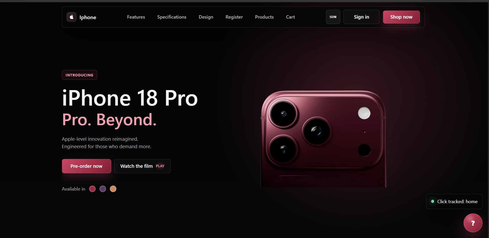

Product film section:

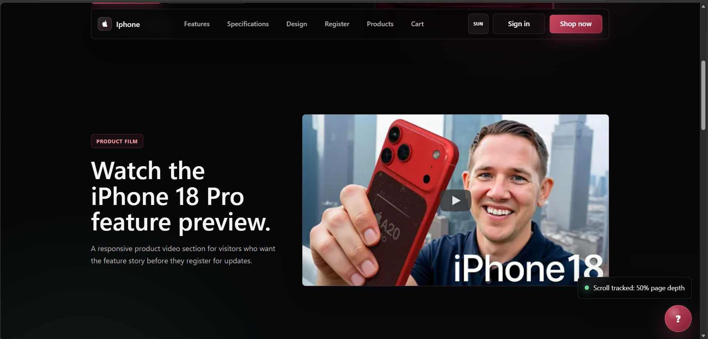

Features section:

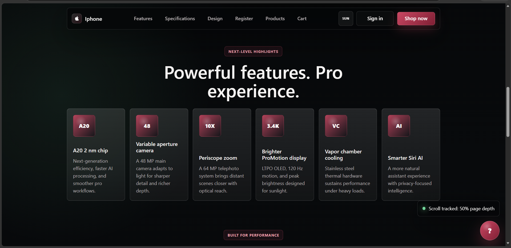

Technical specifications section:

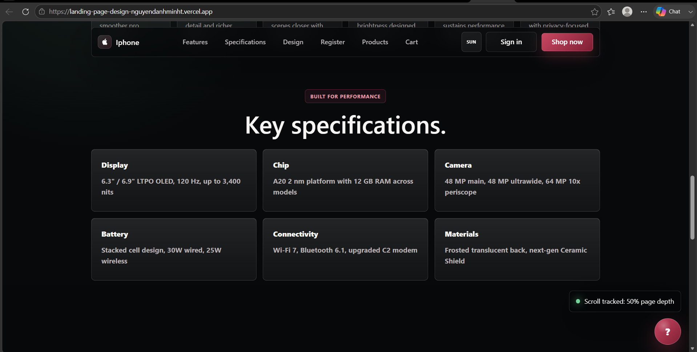

Scrollytelling design section:

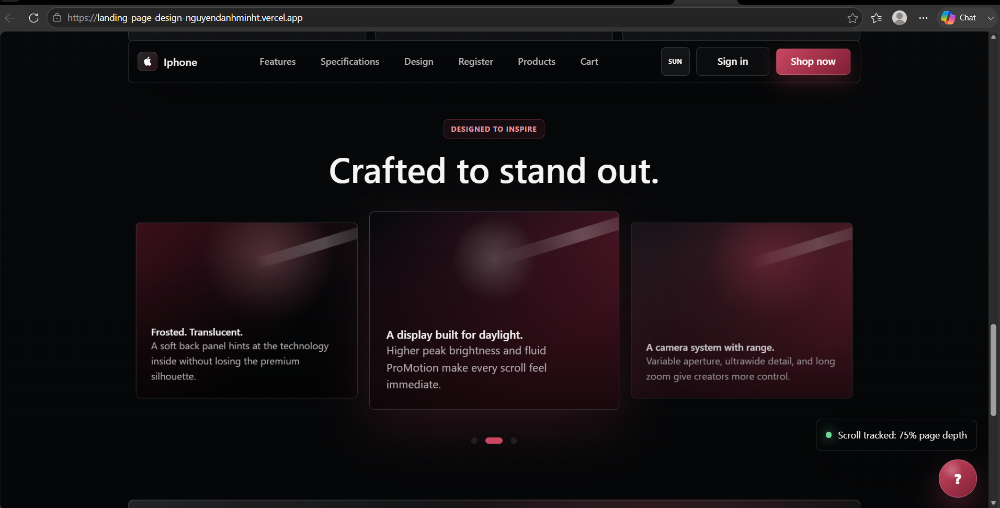

Newsletter signup và footer:

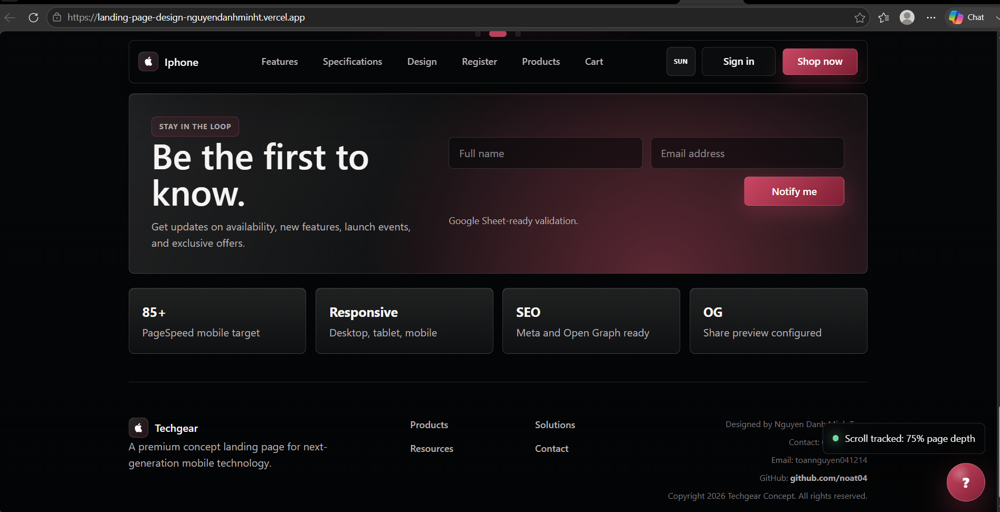

### Ảnh chụp màn hình điểm số Google PageSpeed Insights

Kết quả đo PageSpeed Insights trên bản deploy production:

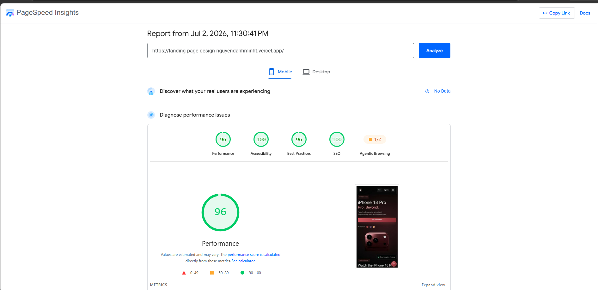

Thông tin báo cáo:

| Hạng mục | Kết quả |
| --- | --- |
| URL kiểm tra | `https://landing-page-design-nguyendanhminht.vercel.app/` |
| Thiết bị | Mobile |
| Thời gian báo cáo | Jul 2, 2026, 11:30:41 PM |
| Performance | 96 |
| Accessibility | 100 |
| Best Practices | 96 |
| SEO | 100 |
| Agentic Browsing | 1/2 |

## Màn hình giao diện các phần điểm cộng làm thêm

Các ảnh minh chứng dưới đây tương ứng với các điểm cộng đã triển khai thêm ngoài yêu cầu cơ bản của đề bài.

### 1. Kiểm tra dữ liệu form, gửi Webhook/Google Sheet và tracking hành vi

Form đăng ký có validate dữ liệu người dùng trước khi gửi. Khi người dùng click, submit hoặc scroll tới các mốc 25%, 50%, 75%, hệ thống ghi nhận hành vi và hiển thị toast realtime.

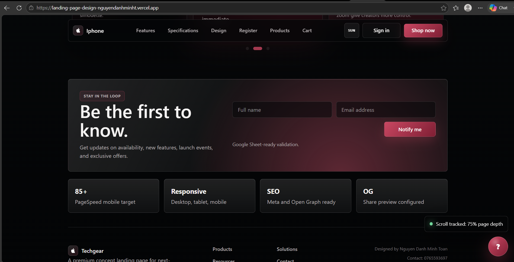

### 2. Dark Mode / Light Mode

Giao diện hỗ trợ chuyển theme bằng nút toggle trên header, sử dụng CSS variables và `data-theme` để đổi màu toàn bộ layout.

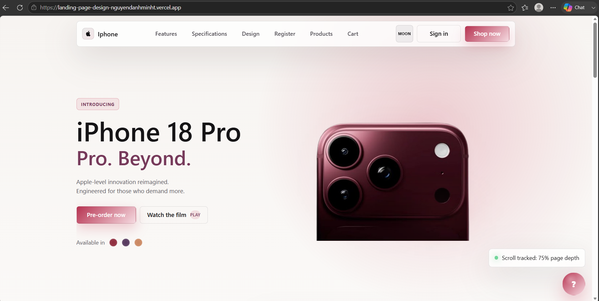

### 3. Scroll Animation, Skeleton Loading và Micro-interactions

Các section bên dưới fold được lazy-load, có placeholder/skeleton nhẹ trong lúc chờ render. Animation reveal, hover state, toast, button state và tương tác story card giúp trải nghiệm mượt hơn.

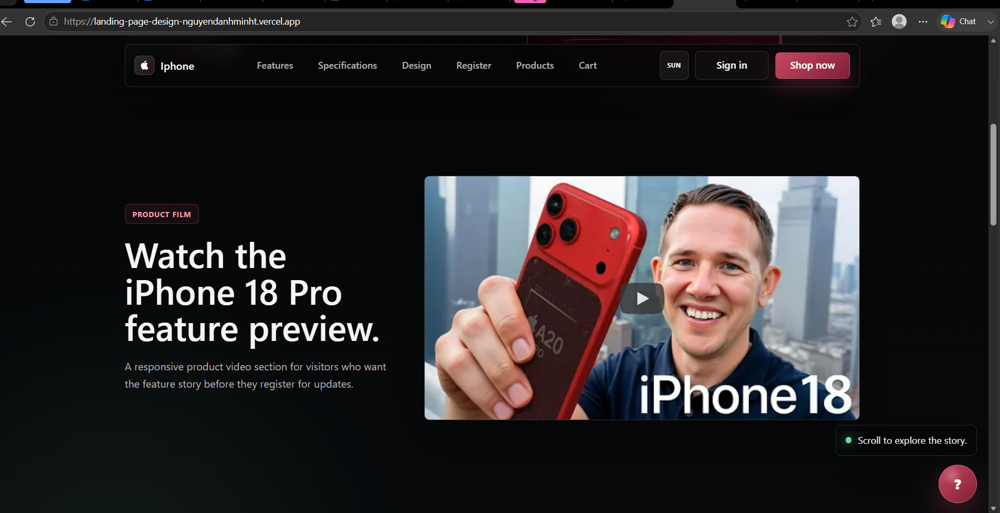

### 4. Backend xử lý lưu trữ dữ liệu

Frontend đã tích hợp REST API cho đăng ký/đăng nhập, sản phẩm, yêu thích, giỏ hàng và chatbot thông qua `src/lib/api.js`. Dữ liệu form đăng ký có thể gửi về Google Sheet hoặc webhook thực tế.

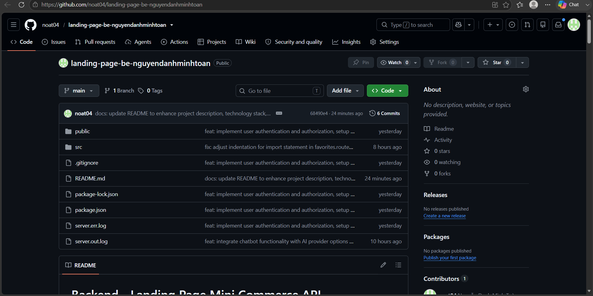

### 5. Scrollytelling kết hợp Parallax

Landing page được thiết kế theo hướng cuộn trang kể chuyện: hero, product film, features, specs, story và signup. Hero có parallax nhẹ bằng GSAP ScrollTrigger, story section có card tương tác để tăng cảm giác cao cấp.

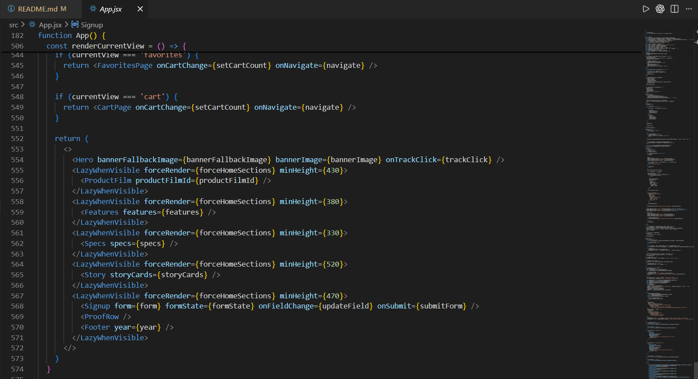

### 6. Tính năng thương mại điện tử mini và chatbot

Luồng mini commerce gồm đăng nhập, đăng xuất, danh sách sản phẩm, chi tiết sản phẩm, lưu yêu thích, giỏ hàng và chatbot tư vấn sản phẩm.

Màn hình đăng nhập / đăng ký:

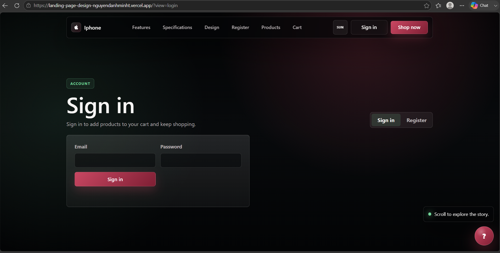

Màn hình danh sách sản phẩm:

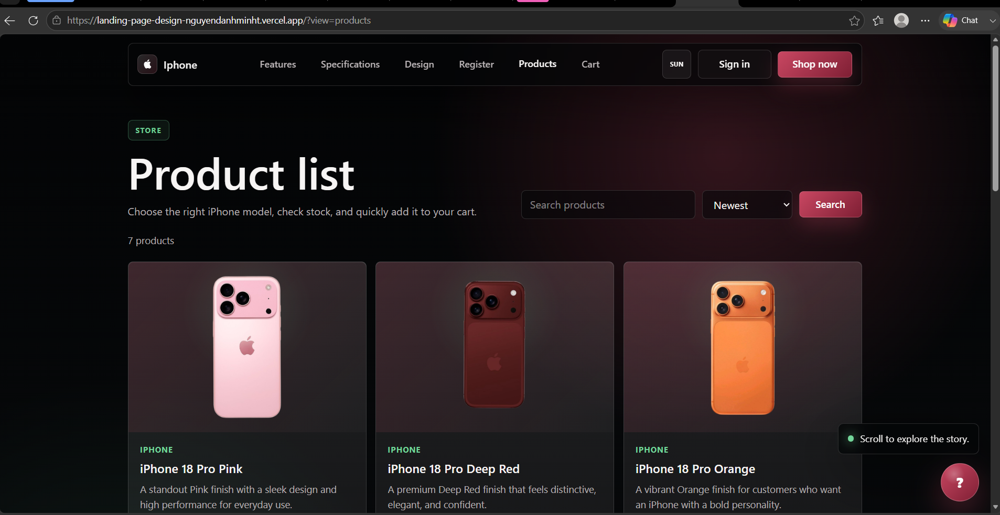

Màn hình chi tiết sản phẩm:

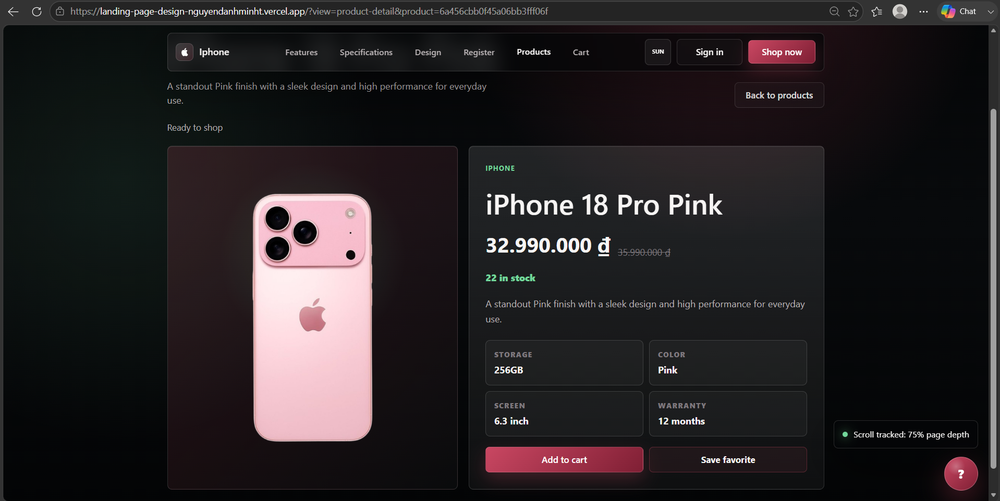

Màn hình sản phẩm yêu thích:

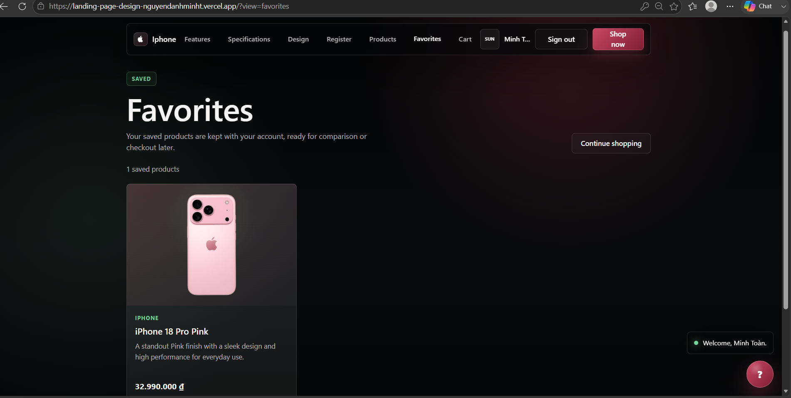

Màn hình giỏ hàng:

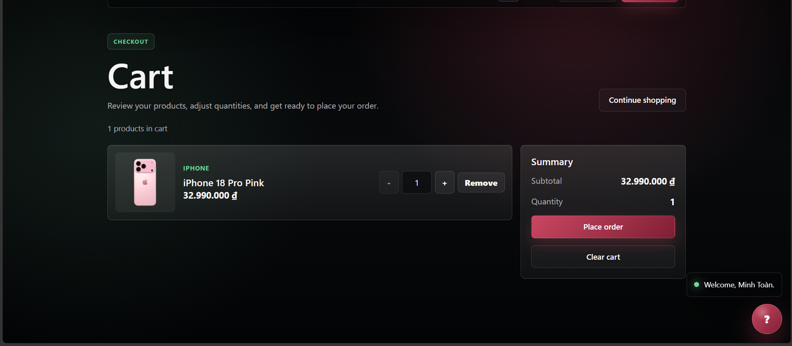

Màn hình chatbot tư vấn sản phẩm:

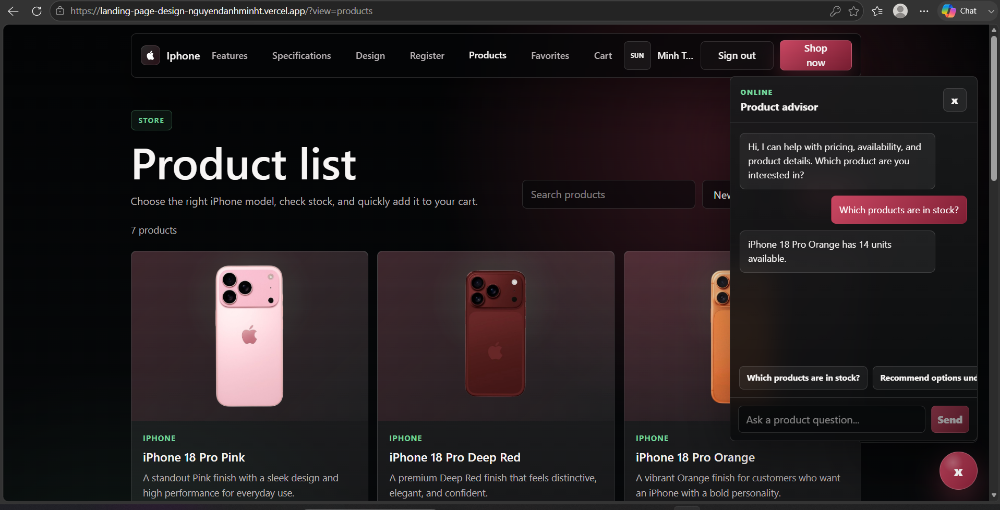

